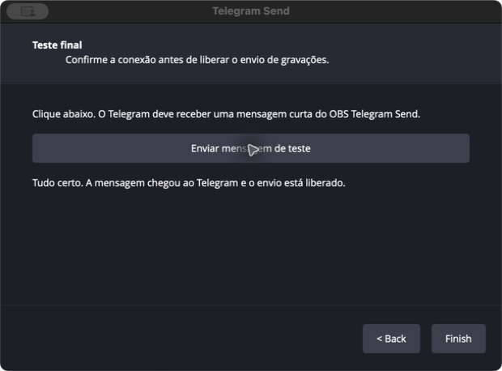
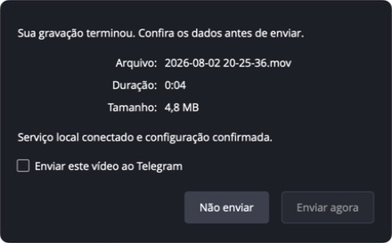
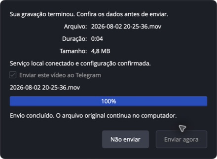

# Primeiros passos — OBS Telegram Send para macOS

Este guia conecta o OBS ao **seu próprio** chat do Telegram. Reserve alguns
minutos e mantenha o OBS aberto. Você não precisa usar Terminal.

> **Duas capturas ainda pendentes antes do lançamento:** o pacote de release é
> bloqueado até existirem capturas reais do instalador assinado e do menu
> **Ferramentas → Telegram Send**. As telas reais do onboarding e da confirmação
> já estão documentadas abaixo; não há mockups nesta versão.

## 1. Instale o pacote

1. Baixe `OBS-Telegram-Send-macOS.pkg` da release confiável.
2. Dê dois cliques no arquivo e escolha **Continuar** e **Instalar**. O macOS
   pode pedir a senha de administrador do computador.
3. Uma release pública é assinada e notarizada. Se houver um aviso de segurança
   nela, pare e confira a origem da release antes de continuar.
4. Feche e abra o OBS. Se o menu ainda não aparecer, encerre e entre novamente
   na sua conta do macOS e abra o OBS outra vez.

O instalador adiciona o plugin e deixa um pequeno serviço local registrado para
a sua sessão. Ele não envia gravações, não pede tokens e não acessa a internet
automaticamente.

> Para desenvolvimento local, existe um pacote separado chamado
> `OBS-Telegram-Send-macOS-development.pkg`. Ele é unsigned/não notarizado e
> **não é para clientes nem publicação**. Só nessa situação de desenvolvimento,
> após confirmar a origem local, use Ajustes do Sistema → Privacidade e
> Segurança → **Abrir Mesmo Assim**.

## 2. Abra o assistente no OBS

No OBS, abra **Ferramentas → Telegram Send**. O assistente tem quatro etapas.
Cole os dados apenas nos campos mostrados pelo assistente; não envie capturas
de tela com esses dados a ninguém.

## 3. Crie um bot só para este uso

1. Clique em **Abrir BotFather** no assistente, ou abra
   [@BotFather](https://t.me/BotFather) no Telegram.
2. Envie `/newbot` e siga as perguntas do Telegram.
3. Copie o token que o BotFather entregar.
4. Volte ao OBS e cole o token no primeiro campo. Ele fica oculto enquanto você
   digita.

## 4. Obtenha o acesso de aplicativo do Telegram

1. Clique em **Abrir my.telegram.org** ou acesse
   [my.telegram.org](https://my.telegram.org).
2. Entre com o número do seu Telegram e abra **API development tools**.
3. Crie um aplicativo simples e copie `api_id` e `api_hash`.
4. Cole ambos no segundo passo do assistente e avance.

O token, `api_id` e `api_hash` são gravados no Keychain do macOS depois da
confirmação final. Eles não ficam nas cenas do OBS, no pacote ou no arquivo da
gravação.

## 5. Escolha seu chat

1. Abra uma conversa privada com o bot que acabou de criar.
2. O OBS mostrará um comando parecido com `/start abc123`. Envie **exatamente**
   o comando que aparece no seu assistente.
3. Volte ao OBS e clique em **Detectar meu chat**.

Nesse momento o serviço local prepara a conexão com o Telegram. Ele faz a
transição exigida pelo Telegram para receber mensagens localmente; por isso o
bot não deve estar simultaneamente em outra automação que recebe updates.

## 6. Faça o teste final

Clique em **Enviar mensagem de teste**. O botão **Concluir** só é liberado
depois que a mensagem chegar ao seu Telegram. Se falhar, use o
[troubleshooting](troubleshooting-pt-BR.md) em vez de repetir o processo com
dados diferentes.

## 7. Envie uma gravação quando quiser

1. Grave normalmente no OBS e pare a gravação.
2. Uma janela central mostrará o nome, duração e tamanho do arquivo.
3. Marque **Enviar este vídeo ao Telegram** somente se quiser enviar aquele
   arquivo específico. A caixa sempre começa desmarcada.
4. Clique em **Enviar agora**. O botão fica indisponível até você marcar a
   caixa.
5. Aguarde o progresso. Ao terminar, confira o arquivo no Telegram.

**Não enviar** apenas fecha a janela. A gravação permanece no seu Mac em todos
os casos. Em erro de rede, use **Tentar novamente** quando estiver pronto.

## Antes de gravar muito

O limite é **2 GiB** por arquivo. O OBS Telegram Send não compacta, divide nem
apaga arquivos. MP4 é enviado como vídeo; outros formatos, como MKV, são
enviados como documento para preservar o original.
